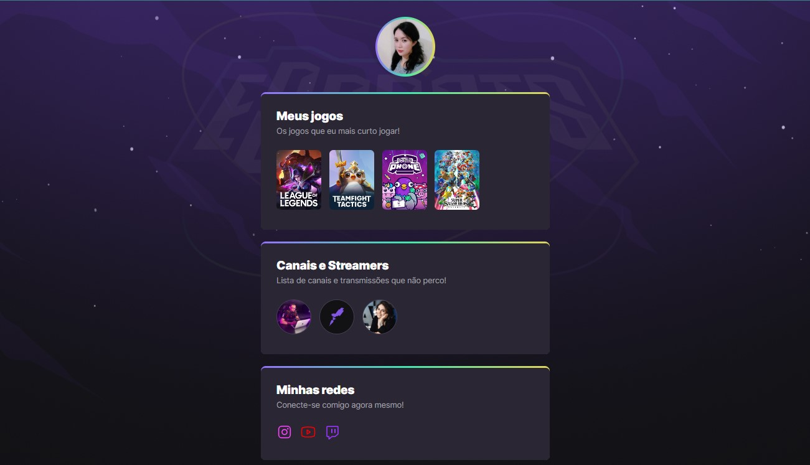

# NLW  e-Sports - RocketSeat 🚀

## Trilha Explorer

> Projeto construído durante o evento: uma página mostrando seus jogos favoritos, canais e streamers que você segue e mostrando links para suas redes sociais

🔗 [Link do projeto](https://larissamidori.github.io/nlw-esports-explore/)
### 🛠 Tecnologias utilizadas:

- HTML
- CSS
- Git e Github
#### 📖 O que foi ensinado:

- Box-sizing: por que usar
- Resetar CSS
- Linear gradient
- Transform: com o scale pode se mudar a escala
- Transition: pode-se criar uma transição mais suave
- Animation: animações nos elementos

